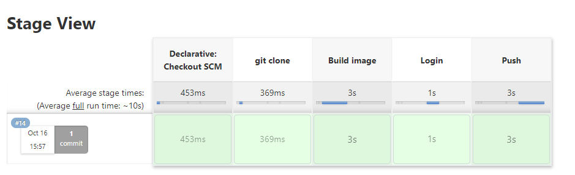

# Docker Final Task

### Requirements: 
Create a Python APP (Flask Based) that:
- Presents the Current Bitcoin Price in USD 
- Presents the Average Price for the last 10 minutes
_______________________________________________
### Developing the app section :
As mentioned before it's a flask app , so in order to build and run the app some packages were installed , such as flask and requests.
In order to get the Bitcoin prices:
- current Bitcoin price : https://api.coindesk.com/v1/bpi/currentprice.json from the website: https://old.coindesk.com/coindesk-api
- Bitcoin prices by minutes: https://min-api.cryptocompare.com/data/v2/histominute?fsym=BTC&tsym=USD&limit=10 from the website: https://min-api.cryptocompare.com/documentation


__________________________________________
### Run the app  :
 In order to run the app:
 1. install pyhton3.10
 2. install the requiremnets (run ```pip install -r requirements.txt```) 
 3. run the app
```
git clone https://github.com/samahAbbas11/Docker_Final_Task.git
python ./bitcoinApp.py
```

You can then access the app here: http://localhost:8888/ 


_______________________________________________
 ### Docker section  :
 #### Dockerfile:
- import pyhton: ```FROM python:3.10.0-alpine3.13```
- copy the requirements.txt file to docker: ```COPY ./requirements.txt /app/requirements.txt```
- create /app directory and move to it: ```WORKDIR /app```
- install the requiered packages: ```RUN pip install -r requirements.txt```
- Copy: its role is to duplicate files/directories: ``COPY . .``
- Expose the port of the flask app : ``EXPOSE 8888``
- run the app: ```CMD [ "python", "./bitcoinApp.py" ]```

#### Dockerhub:
In order to push the docker image after the build we need to create a repo for the app in dockerhub:
https://hub.docker.com/repository/docker/samahabbas11/docker_final


_______________________________________________
 ### Jenkins section  :
 (docker have to be installed on jenkins server)
 - created a new credential with my Docker Hub account details. 
 - created pipeline job in jenkins master
 - import Jenkinsfile from the git repo
 - Jenkinsfile file contains the pipline , where the job is divided into stages (clone, build imaged, login , push)
 


_______________________________________________
 ### Dockerhub repo  :
 


_______________________________________________
 ### Pull from dockerhub from another server & run  :
 


